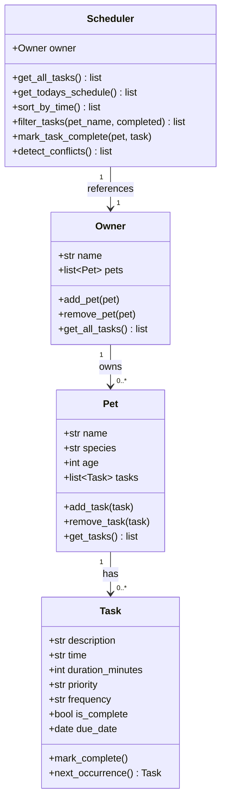

# PawPal+ Project Reflection

---

## System Design

### Three Core User Actions

1. **Add a pet** – The owner enters a pet's name, species, and age to register it in their profile.
2. **Schedule a care task** – The owner picks a pet, describes the activity (e.g., "Morning walk"), sets a time, duration, priority, frequency (once/daily/weekly), and due date.
3. **View today's schedule** – The owner sees all tasks sorted chronologically, with conflict warnings highlighted and the ability to filter by pet or completion status.

---

### Mermaid UML Class Diagram

---

## 1. System Design

**a. Initial design**

The system is built around four classes:

- **Task** (Python dataclass): Holds everything about a single care activity — description, scheduled time (HH:MM), duration in minutes, priority level, recurrence frequency, completion status, and due date. It is a dataclass because it is purely a data container with two small behaviours: marking itself complete and producing the next recurrence.
- **Pet** (Python dataclass): Stores a pet's identity (name, species, age) and owns a list of `Task` objects. It is responsible for adding and removing tasks — no scheduling logic lives here.
- **Owner**: A plain class that aggregates pets and exposes a convenience method (`get_all_tasks`) that flattens all tasks across all pets into a single list of `(Pet, Task)` tuples.
- **Scheduler**: The "brain." It holds a reference to the `Owner` and provides all algorithmic operations: chronological sorting, filtering by pet or status, conflict detection, and recurring-task management. Keeping this logic in a separate class means the data classes stay clean and the scheduling rules can be changed independently.

**b. Design changes**

One change made during implementation: initially `mark_task_complete` was a method directly on `Task`. It was moved to `Scheduler` because the recurrence logic needs to reach back into the `Pet`'s task list to append the next occurrence — a `Task` should not know about `Pet`, so the responsibility was lifted to the layer that already holds both references.

---

## 2. Scheduling Logic and Tradeoffs

**a. Constraints and priorities**

The scheduler considers:
- **Time of day** — tasks are sorted by HH:MM so the owner always sees the next due item at the top.
- **Completion status** — completed tasks are filtered out of the "today's schedule" view by default.
- **Due date** — `get_todays_schedule` restricts results to tasks whose `due_date` matches today.
- **Priority** — stored on each task and displayed so the owner can see what matters most; the current scheduler does not auto-reorder by priority but the field is available for a future enhancement.

The most important constraint chosen was time-of-day ordering, because the primary user need is knowing *what to do next*, not an abstract priority ranking.

**b. Tradeoffs**

The conflict detector checks only for **exact time matches**, not overlapping durations. For example, a 60-minute task at 09:00 and a 30-minute task at 09:45 would overlap by 15 minutes but would not be flagged.

This tradeoff is reasonable for the current scope: exact-match detection is simple to understand, fast to compute, and catches the most obvious scheduling error (two things at the same time). Duration-overlap detection would require converting times to minutes-since-midnight and checking interval intersections — useful, but a natural Phase 2 improvement.

---

## 3. AI Collaboration

**a. How you used AI**

AI (Claude Code) was used throughout the project:
- **Design brainstorming** — asked to identify the four core classes and reason about where scheduling logic should live vs. where data should live.
- **Skeleton generation** — generated method stubs from the UML description, then reviewed them for correctness.
- **Test generation** — asked to produce pytest cases for each algorithmic behaviour (sorting, recurrence, conflict detection, filtering).
- **Debugging** — used inline prompts to explain why `sort_by_time` needed a lambda key on a string rather than a numeric comparison.

The most helpful prompt pattern was providing a concrete constraint: *"The Task should not know about Pet — move any logic that touches both into Scheduler."* Giving AI an explicit design rule produced clean, targeted refactors rather than sprawling rewrites.

**b. Judgment and verification**

An early AI suggestion placed `detect_conflicts` as a method on `Pet`, checking only that pet's own tasks. This was rejected because conflict detection across *different* pets (e.g., two pets owned by the same person need walks at the same time) requires a cross-pet view — which only `Scheduler` has. The method was kept on `Scheduler` and the scope expanded to iterate over all pets in the owner's roster. The decision was verified by writing a test that adds conflicting tasks to two different pets and asserting a warning is produced for each.

---

## 4. Testing and Verification

**a. What you tested**

The test suite (`tests/test_pawpal.py`) covers:
1. `mark_complete()` flips `is_complete` to `True`.
2. `add_task()` increases a pet's task count.
3. A one-off task returns `None` from `next_occurrence()`.
4. `sort_by_time()` returns tasks in chronological order regardless of insertion order.
5. Completing a daily task appends a new task due the next day.
6. Completing a weekly task appends a new task due seven days later.
7. Two tasks at the same time produce exactly one conflict warning containing the time and pet name.
8. Tasks at different times produce no conflicts.
9. `filter_tasks(pet_name=...)` returns only that pet's tasks.
10. `filter_tasks(completed=False)` excludes finished tasks.
11. A pet with no tasks returns an empty schedule and no conflicts.

These tests are important because they cover both the "happy path" and edge cases. The recurrence and conflict tests are especially critical — they verify the two most complex behaviours in the system.

**b. Confidence**

Confidence level: ★★★★☆ (4/5).

All 11 tests pass. The remaining uncertainty is around edge cases not yet tested:
- Tasks that span midnight (e.g., a 23:30 task for a 90-minute duration).
- An owner with zero pets.
- Two pets with the same name.
- Very large task lists (performance).

---

## 5. Reflection

**a. What went well**

The separation of data classes (`Task`, `Pet`) from the logic layer (`Scheduler`) worked cleanly. Each class had a single, clear responsibility, which made testing straightforward — tests for `Task` never needed an `Owner`, and tests for `Scheduler` could set up minimal fixtures.

**b. What you would improve**

If given another iteration, the priority field would be used by `Scheduler` to break time ties and to surface high-priority tasks even when the owner hasn't assigned an exact time. A priority-weighted sorting algorithm would make the app genuinely useful for owners managing many tasks.

**c. Key takeaway**

The most important lesson was that **AI is a fast first-draft generator, not a final architect**. It produced usable code quickly, but every structural decision — where logic lives, what a class is allowed to know about, how to keep the data model clean — required deliberate human judgment. Acting as the "lead architect" meant setting constraints *before* asking the AI to generate, not trying to correct an unconstrained output after the fact.

---

## Smarter Scheduling Features

See README.md → *Smarter Scheduling* section for a summary of the algorithmic features added in Phase 4.
